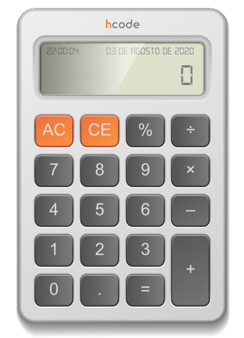

<h1 align="center">
  :bowtie: First JavaScript Project :bowtie:
</h1>

  

  
  
  
  

---

## Calculator JavaScript
**Calculator** made during the [Hcode JavaScript course](https://hcode.com.br/).
 

---

  

---
## Licença

[LICENSE](LICENSE) & [Hcode](https://hcode.com.br/)

---
:shipit: